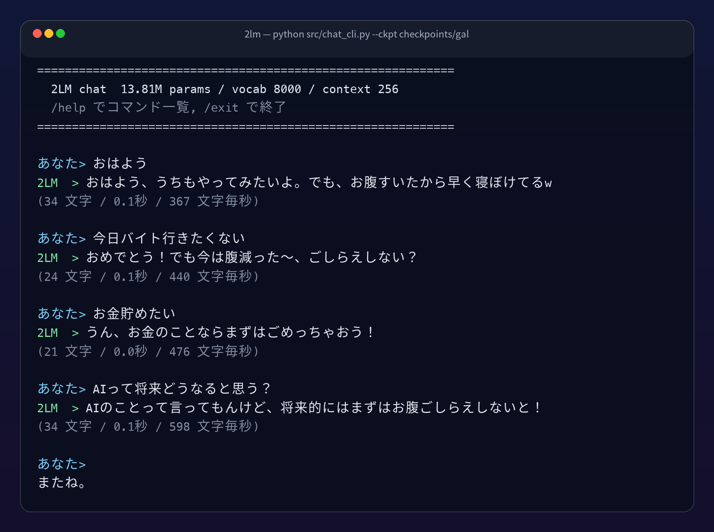
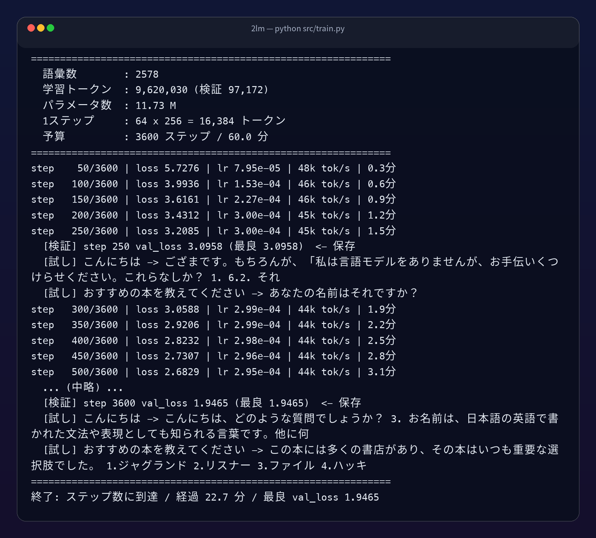
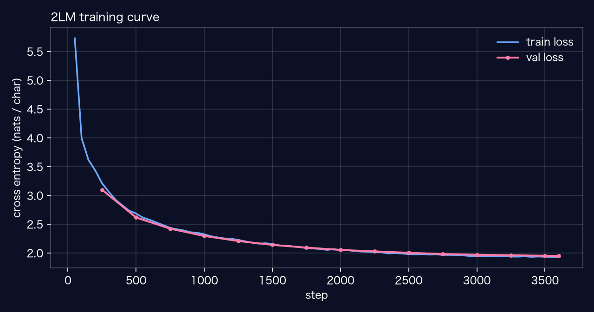
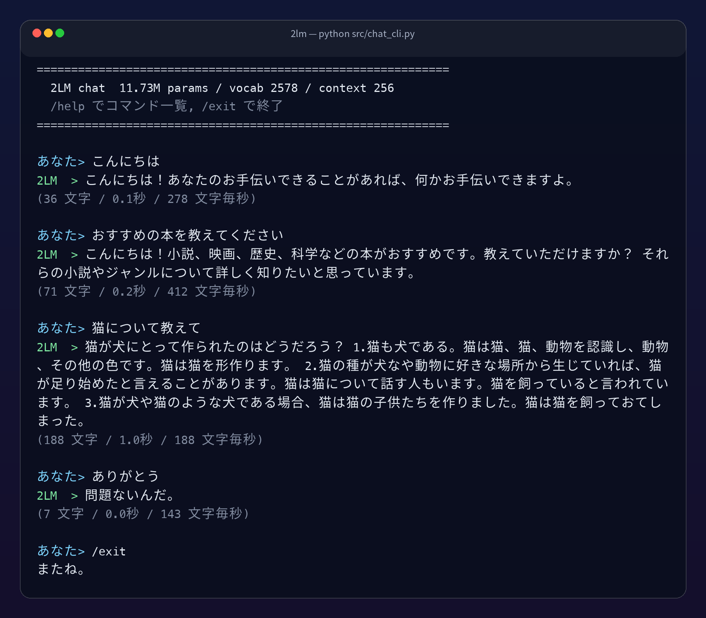
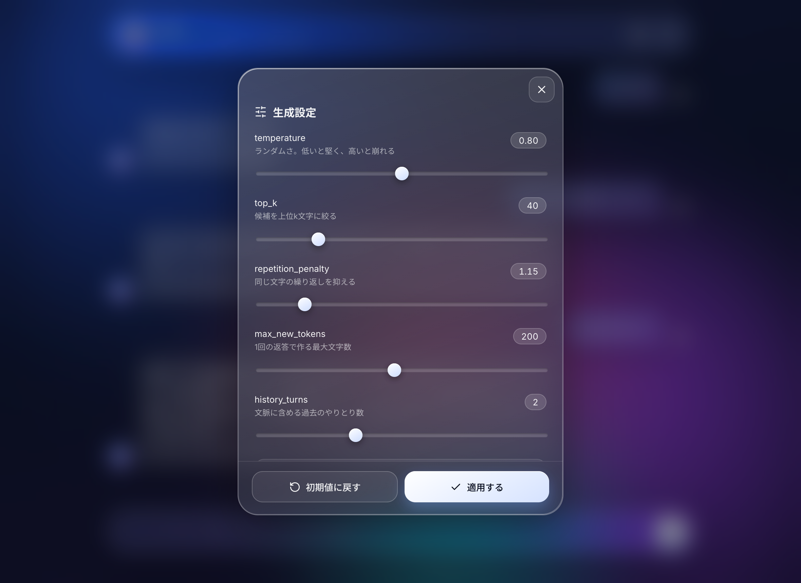
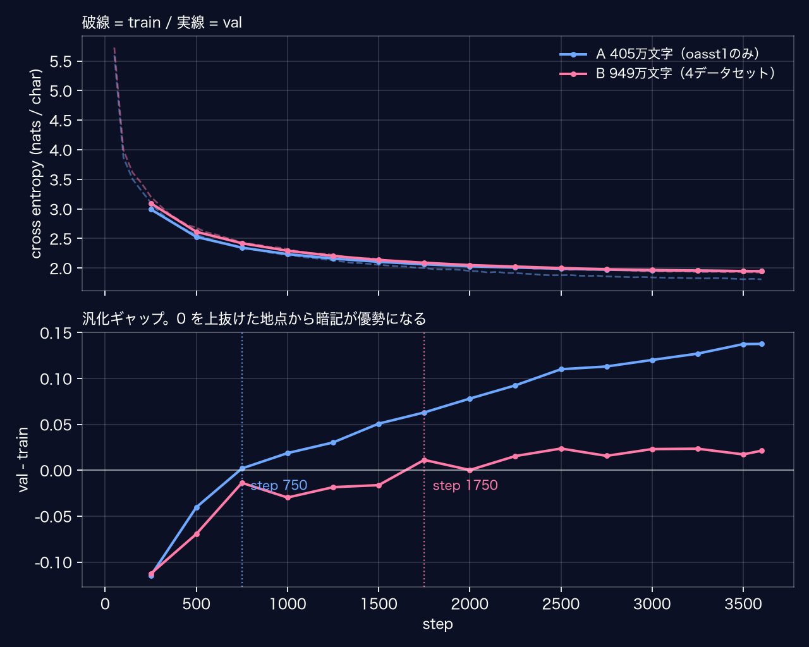
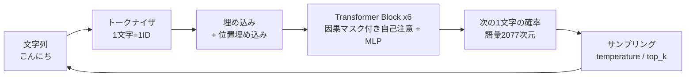

# 2LM-MLX &mdash; 自作ミニ言語モデルを、会話が成立するところまで

Apple Silicon の Mac 1台で、**ライブラリのモデルを一切使わずに** 言語モデルを作って会話するまでの
一式です。ルールベースの応答ではなく、コーパスから学習した Transformer が
「次の1文字」を予測し続けることで会話が成立します。

- フレームワーク: **MLX**（Apple 純正。`pip install mlx` だけでGPUが使える）
- モデル: ミニGPT / 6層 / 384次元 / 6ヘッド / 文脈256トークン / **13.8M パラメータ**
- トークナイザ: SentencePiece unigram / 語彙8,000（文字レベルにも切り替え可）
- データ: Apache-2.0 の日本語対話データセット4件を整形した **949万文字**
- 学習時間: MacBook Pro M1 Max で **約27分**（3,600ステップ）

## 1LM（前作）との関係

これは [1LM](https://github.com/hiroki-abe-58/1LM) の続きです。
1LM は「1時間で動くものを作る」ことを目標にした教材で、解説記事に対応する状態で**凍結しています**。
記事のとおりに手を動かせば同じ数字が出るようにしてあるので、まずはそちらから始めてください。

このリポジトリは、そこで残った「会話が成立しない」という課題に取り組む続編です。
1LM から変わっている点は次のとおりで、**コーパスの作り方が変わっているため
1LM の記事にある数字（28,616会話 / 441万文字）はここでは再現しません**。

- 学習に使えるデータセットを1件から4件に増やした（`--sources`）
- 翻訳が壊れた会話を弾くフィルタを足した（`looks_broken()`）
- バージョン間を比較するための評価の仕組みを追加した（`eval/`）
- 同梱の重みを、増量したコーパスで学習し直したものに差し替えた


## できること

| インターフェース | コマンド |
|---|---|
| CLI チャット | `python src/chat_cli.py` |
| Web GUI（Liquid Glass 風・Chrome） | `python server.py --open` |
| 単発生成 | `python src/generate.py --prompt "こんにちは"` |

## 1時間の流れ

| 時間 | やること |
|---|---|
| 0:00 - 0:10 | 環境構築（conda + mlx） |
| 0:10 - 0:20 | コーパス作成、トークナイザとモデルの説明 |
| 0:20 - 0:50 | 学習（回している間にコードを解説） |
| 0:50 - 0:56 | CLI で会話、サンプリング設定で遊ぶ |
| 0:56 - 1:00 | GUI を Chrome で開いて完成 |

## セットアップ

```bash
# Apple Silicon (arm64) 固定で新しい環境を作る
CONDA_SUBDIR=osx-arm64 conda create -n 2lm python=3.11 -y
conda activate 2lm
conda config --env --set subdir osx-arm64

pip install -r requirements.txt
python -c "import mlx.core as mx; print(mx.default_device())"   # Device(gpu, 0) と出ればOK
```

Windows / Linux でも `mlx` を `torch` に読み替えれば同じ構成が組めますが、
このリポジトリは MLX 専用（= Apple Silicon 専用）です。

## 1. コーパスを作る

```bash
python data/prepare.py --exclude eval/holdout.txt
```

`data/corpus.txt` に「1行1会話」のテキストが約950万文字ぶんできます。
`--exclude` は採点用の検証セットを訓練から外すためのもので、
あとで [4. 採点する](#4-採点する) をやるなら必ず付けてください。

```
<|user|>おすすめの本はありますか？<|assistant|>SFがお好きなら...<|end|>
```

主なオプション。

```bash
python data/prepare.py --sources oasst1   # 1LM（前作）と同じ1件だけ使う（約400万文字）
python data/prepare.py --max-a 150        # 短い返答だけ使う（学習が安定しやすい）
python data/prepare.py --min-char-freq 20 # 語彙をさらに絞る
python data/prepare.py --no-hf            # data/raw/ の自分のデータだけで作る
```

### 使えるデータセット

既定では次の4件すべてを使います。`--sources` で絞れます。`--list-sources` で一覧が出ます。

| キー | データセット | 特徴 |
|---|---|---|
| `oasst1` | [kunishou/oasst1-89k-ja](https://huggingface.co/datasets/kunishou/oasst1-89k-ja) | 既定。翻訳失敗フラグつきで扱いやすい |
| `oasst2` | [llm-jp/oasst2-33k-ja](https://huggingface.co/datasets/llm-jp/oasst2-33k-ja) | DeepL 翻訳。失敗フラグが無いので自前で弾く |
| `magpie` | [llm-jp/magpie-sft-v1.0](https://huggingface.co/datasets/llm-jp/magpie-sft-v1.0) | 最初から日本語の合成データ。訳崩れが無い |
| `tanuki` | [Aratako/Magpie-Tanuki-8B-97k](https://huggingface.co/datasets/Aratako/Magpie-Tanuki-8B-97k) | 同上。品質フィルタ未実施と明記されている |

**4つとも Apache-2.0 で、ShareAlike（継承）条件がありません。** 日本語の対話データには
CC BY-SA のものも多いのですが、継承条件が学習済みの重みに及ぶかは決着していない論点なので、
重みを配布する前提のこのリポジトリでは最初から候補に入れていません。詳しくは [NOTICE](NOTICE) を参照してください。

### 自分のデータで学習する

`data/raw/` に次のいずれかの形式で置いて `python data/prepare.py` を実行するだけです。

```jsonc
// data/raw/mydata.jsonl
{"user": "調子はどう？", "assistant": "ばっちりです。"}
```

```tsv
# data/raw/mydata.tsv
調子はどう？	ばっちりです。
```

文字レベルなので、**数万文字では文法が立ち上がりません**。最低でも100万文字は欲しいところです。

### キャラクターを持たせる

架空の「ギャルのLINE」会話コーパスを作るスクリプトを同梱しています。
**モデルの人格はデータの人格**であることを、いちばん短時間で体験できます。

会話文は人間が書きません。ローカルで動かす **Qwen2.5-32B-Instruct（Apache-2.0）** に書かせます。
Apache-2.0 のモデルには出力の利用条件がないので、作ったデータと重みをそのまま配布できます。

```bash
python data/gal/generate.py --stage topics          # 話題を列挙させる
python data/gal/generate.py --stage pairs --target 4000   # 会話を書かせる（止めても再開できる）
python data/gal/generate.py --stage build           # 検査してまとめる
```

そのうえで、事前学習済みの重みに追加学習します。**40秒で終わります。**

```bash
python data/prepare.py --no-hf --out data/corpus_gal.txt --min-char-freq 1
python src/train.py --init-from checkpoints/final --corpus data/corpus_gal.txt \
    --cache-dir data/cache_gal --out checkpoints/gal --lr 1e-4 --warmup 12 --steps 90
```

実測は 2,610会話 / 111,574文字。出来上がったモデルはこう喋ります。



何を聞いても腹が減っているのは、データ側で返答の「機嫌」を5種類均等に振っていて、
空腹と眠気が40%を占めているからです。**データの偏りがモデルの癖になります。**

代償もあります。固定検証セットでの bits/char は 2.584 → 3.550、
主題保持率は 0.733 → 0.267 と悪化します。汎用の応答能力を口調と引き換えにしています。

混合比の実測、検査でふるいにかける基準、そして **この作業でMacをカーネルパニックで
1回落とした話**は `data/gal/README.md` にまとめてあります。

## 2. 学習する

```bash
python src/train.py                             # 4,300ステップ（M1 Maxで35分前後。既定の35分で打ち切り）
python src/train.py --minutes 5                 # まず5分だけ試す
python src/train.py --steps 8000 --minutes 70   # じっくり
```

- `--minutes` は保険です。**ステップ数は自分のマシンの実測 tok/s から逆算**してください
  （`cosine_decay` は総ステップ数を前提に学習率を下げるため、途中打ち切りは損）。
  逆算にはベンチマーク値ではなく通しの実測値を使うこと。検証とサンプル生成のぶん、
  ベンチマークより2割ほど遅くなります（実測: ベンチ37k tok/s に対し通しは31k tok/s）。
- 検証損失が改善したときだけ `checkpoints/final/` に保存します。
- 250ステップごとに「こんにちは」への返答を出力するので、賢くなっていく様子が見られます。

### トークナイザを選ぶ

既定は文字レベル（1文字=1トークン）です。`--vocab-size` を渡すと
SentencePiece のサブワードに切り替わり、1トークンで複数文字を運べるようになります。

```bash
python src/train.py --vocab-size 8000      # サブワード（語彙8,000）
python tools/pick_vocab.py                 # 語彙サイズごとの圧縮率を実測する
```

語彙を大きくするほど1トークンあたりの文字数は増えますが、埋め込みのパラメータが増え、
1つの語彙を学習中に見かける回数が減ります。手元のコーパスでの実測は次のとおりです。

| 語彙 | 文字/トークン | 総トークン数 | 埋め込み | トークン/語彙 |
|---|---|---|---|---|
| 4,000 | 1.95 | 574万 | 1.54M | 1,434 |
| 8,000 | 2.36 | 473万 | 3.07M | 591 |
| 12,000 | 2.56 | 436万 | 4.61M | 363 |
| 16,000 | 2.70 | 414万 | 6.14M | 259 |
| 24,000 | 2.87 | 389万 | 9.22M | 162 |

4,000→8,000 で +0.42文字/トークン 稼げるのに対し、8,000→12,000 は +0.20 しかありません。
埋め込みは 1.5M ずつ増え続けるので、この規模では **8,000 で頭打ち**と判断しています。





同梱の重みの実測値（MacBook Pro M1 Max / 32コアGPU）。

| 項目 | 値 |
|---|---|
| 学習時間 | 27.1分 / 3,600ステップ |
| 学習トークン | 469万（検証 4.7万） |
| 語彙 / パラメータ | 8,000 サブワード / 13.81M |
| 最終 train loss | 3.421 |
| 最良 val loss | 3.603 |
| スループット | 36k tok/s |
| 生成速度 | 320〜800 文字/秒 |

この val loss は**このコーパスを、このトークナイザで測った値**です。
語彙が変わればランダム予測の損失自体が変わる（`ln(8000) = 8.99`）ので、
コーパスやトークナイザが違う実行どうしで水準を比べることはできません。
バージョン間の比較には [4. 採点する](#4-採点する) の `bits/char` を使ってください。

## 3. 会話する

### CLI

```bash
python src/chat_cli.py
```

```
あなた> おすすめの本を教えてください
2LM  > もちろん、どのようなジャンルの本がおすすめかを教えていただけますか？ 例えば、小説、
       ミステリー、自己啓発、歴史など、幅広いジャンルを選んでみることができます。
       また、好みや好みによって選ぶことができます。
(101 文字 / 0.2秒 / 645 文字毎秒)
```



チャット中のコマンド。

| コマンド | 意味 |
|---|---|
| `/temp 0.6` | ランダムさを変える |
| `/topk 40` | 候補を上位k文字に絞る |
| `/penalty 1.2` | 繰り返しを抑える |
| `/reset` | 会話履歴を消す |
| `/exit` | 終了 |

### Web GUI

```bash
python server.py --open      # Chrome が開く
```


右上のスライダーアイコンから、`temperature` などを触りながら挙動を比べられます。



## 4. 採点する

「なんか賢くなった気がする」を潰すための評価スクリプトです。
固定20問と固定検証セットで採点し、前回の結果と並べて表示します。

```bash
python eval/run.py --make-holdout           # 固定検証セットを切り出す（最初に1回）
python eval/run.py --tag base               # 採点して runs/eval_base.json に保存
python eval/run.py --tag next --compare base # 前回と並べる
```

学習し直すときは、検証セットを暗記させないよう必ず除外してください。

```bash
python data/prepare.py --exclude eval/holdout.txt
```

指標は4つです。実測値は、モデルの形と学習設定（3,600ステップ）を揃えたまま
データ量とトークナイザだけを変えて比べたものです。右端が同梱の重みです。

| 指標 | 意味 | 文字/405万 | 文字/949万 | サブワード/949万 |
|---|---|---|---|---|
| bits/char | 検証セットの損失を1文字あたりのビット数に正規化 | 3.282 | 2.809 | **2.584** |
| 反復率 | 同じ3文字並びが3回以上出る返答の割合 | 10.0% | 15.0% | **10.0%** |
| 主題保持率 | 質問の主題語が返答に現れた割合 | 40.0% | 46.7% | **73.3%** |
| 破綻率 | 空・極端に短い・打ち切りで終わった返答の割合 | 0.0% | 5.0% | **0.0%** |

20問しかないので、反復率と破綻率の 5ポイント差は 1問ぶんです。差として読まないでください。
はっきり動いているのは bits/char と主題保持率の2つです。

`bits/char` にしているのは、**トークナイザを変えても比較できるようにする**ためです。
文字レベルからサブワードに変えると1トークンの予測は難しくなるので、
`nats/token` のままだと改善しても悪化して見えます。

### 検証セットは全ソースから切ること

`--make-holdout` は、そのとき渡したコーパスの末尾から検証セットを切ります。
**学習に使う予定のデータセットを全部混ぜたコーパスから切ってください。**

最初これを oasst1 だけから切ってしまい、oasst1 だけで学習したモデルにとってだけ
「見慣れた文体」の物差しになりました。その結果、体感で明らかに良くなっている
増量版のほうが bits/char は悪い、という逆転した数字が出ました。

### 学習曲線を並べる

```bash
python tools/compare_runs.py runs/exp/loss_a.csv:A runs/exp/loss_b.csv:B --out docs/images/loss-ab.png
```



下段が汎化ギャップ（val - train）です。0 を上抜けた地点から暗記が優勢になります。
データを 2.34倍にすると、この地点が step 750 から 1,750 へ、ほぼ比例して後ろにずれました。

なお `runs/*.csv` の val loss は run ごとに別の文章で測っているので、
**水準そのものを run 間で比べてはいけません**。比べられるのは曲線の形と、
共通の検証セットで測った bits/char だけです。

## 仕組み



ファイルの役割。

| ファイル | 役割 |
|---|---|
| [src/tokenizer.py](src/tokenizer.py) | 文字レベルトークナイザ。`<\|user\|>` などのマーカーは1トークン扱い |
| [src/model.py](src/model.py) | ミニGPT本体。因果マスク付き自己注意、Pre-LN、weight tying |
| [src/train.py](src/train.py) | 学習ループ。`mx.compile` + AdamW + warmup/cosine |
| [src/generate.py](src/generate.py) | サンプリング。temperature / top-k / 繰り返しペナルティ |
| [src/chat_cli.py](src/chat_cli.py) | CLIチャット |
| [server.py](server.py) | FastAPI。SSE でトークンを流す |
| [web/](web/) | Liquid Glass 風のチャットGUI |
| [data/prepare.py](data/prepare.py) | コーパス整形 |
| [data/gal/](data/gal/) | 架空の「ギャルのLINE」コーパス生成。ローカルLLMで作る |
| [eval/run.py](eval/run.py) | 固定20問での採点。bits/char・反復率・主題保持率・破綻率 |
| [tools/mix_corpus.py](tools/mix_corpus.py) | コーパスを比率を決めて混ぜる（追加学習用） |
| [tools/compare_runs.py](tools/compare_runs.py) | 複数の学習ログを重ねて、乖離点を出す |
| [tools/pick_vocab.py](tools/pick_vocab.py) | 語彙サイズごとの圧縮率とパラメータ増を実測する |
| [tools/](tools/) | 記事用の作図・撮影ツール（`pip install -r requirements-dev.txt`） |

## つまずきポイント

制作中に踏んだ罠のうち、質問が多そうなものを挙げておきます。

1. **返答が同じ言葉を繰り返す** → モデルではなくサンプリングを疑う。`repetition_penalty` を 1.15 前後に。
2. **返答が毎回崩れる** → 推論前に `model.eval()` を呼んで Dropout を切る。
3. **学習が異常に遅い** → `ps aux | grep train.py` で二重起動を確認する。
   `python src/train.py | tee log` を Ctrl-C や `kill` で止めても、`tee` だけが死んで
   Python 側が生き残ることがある。GPU を食い合って tok/s が半分以下になる。
4. **`mx.compile` した学習ステップで Dropout が効かない** → `mx.random.state` を
   入出力に渡さないと、コンパイル時の乱数が固定されてしまう。
5. **`conda` で入れた MLX が動かない** → x86_64 の Python になっていないか確認する。
   `CONDA_SUBDIR=osx-arm64` を付けて環境を作り直すのが速い。

## 学習済みモデルについて

`checkpoints/final/` に学習済みの重みを同梱しています（13.8M パラメータ fp32 で約53MB）。
クローンすればすぐ会話できます。

```
checkpoints/final/
├── model.safetensors   # 重み
├── config.json         # モデル構成
└── tokenizer.json      # 語彙（文字→ID）
```

自分で学習し直すと同じ場所が上書きされます。残しておきたい場合は
`--out checkpoints/myrun` を指定してください。

### GitHubへ公開する

```bash
gh repo create my-lm --public --source . --remote origin --push
# または
git remote add origin git@github.com:<your-account>/my-lm.git
git push -u origin main
```

`model.safetensors` は約53MBあり、GitHub の警告ライン(50MB)を超えています。
push は通りますが警告が出ます。100MB を超えると拒否されるので、
これ以上大きいモデルを配る場合は Hugging Face Hub か Git LFS に移してください。

## ライセンス / クレジット

**コード**は MIT License です（[LICENSE](LICENSE)）。

**同梱の学習済みモデル**は、以下の Apache-2.0 データセットから学習しています。
再配布・商用利用のいずれの場合も、この出典表示を残してください。

- 原典: [OpenAssistant/oasst1](https://huggingface.co/datasets/OpenAssistant/oasst1)（Apache-2.0）
- 日本語版: [kunishou/oasst1-89k-ja](https://huggingface.co/datasets/kunishou/oasst1-89k-ja)（Apache-2.0。Google翻訳による日本語化）

前処理で加えた変更点とライセンス全文は [NOTICE](NOTICE) と
[licenses/Apache-2.0.txt](licenses/Apache-2.0.txt) にあります。

生成される文章は、コーパスの統計から次の1文字を予測し続けた結果にすぎません。
事実性は一切保証されず、実在の人物や団体について誤った内容を出力することがあります。
出力を公開の場に掲載する場合は、機械生成物である旨を明記してください。
